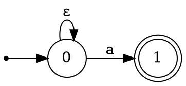

# 🔁 正则表达式自动机转换器 (Lab 2)

> **Regex → NFA → DFA → 最小 DFA**  
> 基于 Thompson 构造、子集构造、表填充算法的完整实现

[](https://www.python.org/)
[](https://streamlit.io/)
[](https://github.com/astral-sh/uv)

---

## 📖 目录

- [项目概述](#-项目概述)
- [功能特性](#-功能特性)
- [算法原理](#-算法原理)
- [快速开始](#-快速开始)
- [项目结构](#-项目结构)
- [使用方法](#-使用方法)
- [支持的正则语法](#-支持的正则语法)
- [导出功能](#-导出功能)
- [技术实现](#-技术实现)
- [开发信息](#-开发信息)

---

## 🎯 项目概述

本项目是编译原理课程实验 2 的完整实现，涵盖正则表达式到有限自动机的转换全流程：

1. **Thompson 构造算法**：将正则表达式转换为非确定有限自动机（NFA）
2. **子集构造算法**：将 NFA 转换为确定有限自动机（DFA）
3. **表填充算法**：将 DFA 最小化为等价的最小 DFA

项目提供两种使用方式：
- 🌐 **Streamlit Web 界面**：交互式可视化，支持实时预览和导出
- 💻 **命令行 CLI**：支持批处理和交互菜单模式

### 实验任务覆盖

| 任务 | 描述 | 状态 |
|------|------|------|
| 正则解析 | 中缀表达式转后缀，处理连接符 | ✅ 已完成 |
| NFA 构造 | Thompson 构造算法实现 | ✅ 已完成 |
| DFA 转换 | 子集构造算法（ε-闭包）| ✅ 已完成 |
| DFA 最小化 | 表填充算法（等价类划分）| ✅ 已完成 |
| 字符串匹配 | NFA/DFA 模拟识别 | ✅ 已完成 |
| 可视化 | Graphviz DOT/PNG 导出 | ✅ 已完成 |
| Web 界面 | Streamlit 交互式演示 | ✅ 已完成 |

---

## ✨ 功能特性

### 🧮 核心算法

- ✅ **正则表达式解析**
  - 自动插入隐式连接符
  - 中缀转后缀（调度场算法）
  - 运算符优先级：`*` > `.`（连接）> `|`

- ✅ **Thompson 构造**
  - 支持基本字符、连接、选择、闭包
  - 生成带 ε 转移的 NFA

- ✅ **子集构造**
  - ε-闭包计算
  - 状态集合到 DFA 状态映射
  - 自动确定接受状态

- ✅ **DFA 最小化**
  - 表填充算法（标记等价/非等价状态对）
  - 等价类合并（并查集实现）
  - 死状态消除

### 🔍 字符串匹配

- ✅ NFA 模拟（BFS 遍历所有可能路径）
- ✅ DFA/最小 DFA 直接匹配
- ✅ 匹配路径追踪与可视化
- ✅ 批量字符串检测

### 🖥️ 可视化界面

- ✅ Streamlit Web 应用
- ✅ 实时正则表达式解析
- ✅ 状态转移表展示（NFA/DFA/MinDFA）
- ✅ Graphviz 图形渲染
- ✅ DOT/PNG/HTML 一键导出

### 📤 导出功能

- ✅ Graphviz DOT 格式
- ✅ PNG 图像（需安装 Graphviz）
- ✅ 离线 HTML（内嵌 Viz.js，无需服务器）

---

## 📚 算法原理

### 转换流程图

```
┌──────────────────────────────────────────────────────────────────────────┐
│                        自动机转换流程                                      │
├──────────────────────────────────────────────────────────────────────────┤
│                                                                          │
│   ┌─────────────┐     ┌─────────────┐     ┌─────────────┐               │
│   │   正则表达式  │     │   后缀表达式  │     │     NFA     │               │
│   │  (a|b)*abb  │────▶│  ab|*a.b.b. │────▶│  ε-NFA      │               │
│   └─────────────┘     └─────────────┘     └─────────────┘               │
│          │                   │                   │                       │
│          │            调度场算法            Thompson 构造                 │
│          │                                       │                       │
│          │                                       ▼                       │
│          │                               ┌─────────────┐                │
│          │                               │     DFA     │                │
│          │                               │  确定自动机   │                │
│          │                               └─────────────┘                │
│          │                                       │                       │
│          │                                 子集构造                       │
│          │                                       │                       │
│          │                                       ▼                       │
│          │                               ┌─────────────┐                │
│          │                               │   MinDFA    │                │
│          │                               │  最小化 DFA  │                │
│          └───────────────────────────────└─────────────┘                │
│                                                  │                       │
│                                            表填充算法                     │
│                                                                          │
└──────────────────────────────────────────────────────────────────────────┘
```

### Thompson 构造规则

| 正则 | 构造方式 |
|------|----------|
| `a` (单字符) | `○ ──a──▶ ◎` |
| `AB` (连接) | `○A ──ε──▶ ○B` |
| `A\|B` (选择) | 新起点 ε 分叉到 A、B，A、B 终点 ε 合并到新终点 |
| `A*` (闭包) | 新起点 ε 到 A 和新终点，A 终点 ε 回 A 起点和新终点 |

### 子集构造核心

```python
def epsilon_closure(states):
    """计算状态集合的 ε-闭包"""
    closure = set(states)
    stack = list(states)
    while stack:
        s = stack.pop()
        for t in transitions[s].get(EPSILON, []):
            if t not in closure:
                closure.add(t)
                stack.append(t)
    return frozenset(closure)
```

### 表填充算法

1. **初始化**：接受状态与非接受状态标记为不等价
2. **迭代传播**：如果 (p,q) 对某符号 a 转移到已标记不等价的状态对，则标记 (p,q)
3. **合并**：未标记的状态对等价，用并查集合并

---

## 🚀 快速开始

### 环境要求

- **Python** >= 3.11
- **uv** 包管理器（推荐）
- **Graphviz**（可选，用于生成 PNG）

### 安装步骤

```bash
# 进入项目目录
cd lab2-new

# 使用 uv 安装依赖
uv sync

# 运行 Web 界面（推荐）
uv run streamlit run app.py

# 或运行 CLI
uv run python main.py
```

### Graphviz 安装（可选）

如需生成 PNG 图像，请安装 Graphviz：

```bash
# Ubuntu/Debian
sudo apt install graphviz

# macOS
brew install graphviz

# Windows (使用 winget)
winget install graphviz
```

---

## 📁 项目结构

```
lab2-new/
├── 📄 README.md                 # 本文档
├── 📄 pyproject.toml            # 项目配置与依赖
├── 📄 uv.lock                   # 依赖锁定文件
├── 📄 .python-version           # Python 版本要求
├── 📄 main.py                   # CLI 命令行入口
├── 📄 app.py                    # Streamlit Web 界面
│
└── 📁 src/                      # 核心源代码
    ├── __init__.py
    ├── automata.py             # 核心算法（NFA/DFA/MinDFA）
    ├── exporting.py            # Graphviz 导出
    └── html_export.py          # 离线 HTML 生成
```

### 核心模块说明

| 模块 | 文件 | 职责 |
|------|------|------|
| **自动机算法** | `src/automata.py` | Thompson 构造、子集构造、DFA 最小化、匹配识别 |
| **图形导出** | `src/exporting.py` | 生成 Graphviz DOT 格式，调用 dot 渲染 PNG |
| **HTML 生成** | `src/html_export.py` | 生成内嵌 Viz.js 的离线可视化页面 |
| **Web 界面** | `app.py` | Streamlit 交互式前端 |
| **命令行** | `main.py` | CLI 批处理与交互菜单 |

---

## 💻 使用方法

### Web 界面模式（推荐）

```bash
uv run streamlit run app.py
```

启动后访问 `http://localhost:8501`，功能包括：

1. 📝 输入正则表达式
2. 📊 查看 NFA/DFA/MinDFA 状态图
3. 📋 查看状态转移表
4. 🔍 单串/批量字符串检测
5. 📥 导出 DOT/PNG/HTML

### 命令行模式

#### 交互模式

```bash
uv run python main.py
```

进入交互菜单：
```
请输入正规表达式（回车使用默认 (a|b)*abb）：(a|b)*abb

【操作菜单】
1. 批量测试字符串是否被接受
2. 查看 NFA/DFA 转移表
3. 显示匹配路径（逐步演示）
4. 导出 Graphviz (.dot/.png)
5. 生成离线可视化 HTML
6. 换一个正则表达式
0. 退出
```

#### 批处理模式

```bash
# 指定正则和测试字符串
uv run python main.py --regex "(a|b)*abb" --strings abb aabb ab

# 生成离线 HTML
uv run python main.py --regex "(a|b)*abb" --output-html result.html --no-interactive

# 导出 DOT 文件
uv run python main.py --regex "a*b*" --dump-dot --no-interactive
```

#### 命令行参数

| 参数 | 说明 |
|------|------|
| `--regex` | 指定正则表达式（默认 `(a|b)*abb`）|
| `--strings` | 待检测字符串列表（空格分隔）|
| `--output-html` | 输出离线 HTML 文件路径 |
| `--no-png` | 导出 DOT 时不尝试生成 PNG |
| `--no-interactive` | 仅执行批处理，不进入交互菜单 |
| `--dump-dot` | 额外输出 DOT 文件到当前目录 |

---

## 📝 支持的正则语法

### 基本语法

| 语法 | 含义 | 示例 |
|------|------|------|
| `a` | 匹配单个字符 a | `a` 匹配 "a" |
| `AB` | 连接（隐式，自动插入） | `ab` 匹配 "ab" |
| `A\|B` | 选择（A 或 B） | `a\|b` 匹配 "a" 或 "b" |
| `A*` | 闭包（0 次或多次） | `a*` 匹配 "", "a", "aa", ... |
| `(A)` | 分组 | `(ab)*` 匹配 "", "ab", "abab", ... |

### 运算符优先级

1. `*` (闭包) - 最高
2. `.` (连接) - 中等（隐式，自动插入）
3. `|` (选择) - 最低

### 示例

| 正则表达式 | 匹配示例 | 不匹配示例 |
|------------|----------|------------|
| `(a\|b)*abb` | "abb", "aabb", "babb", "aaabbb" | "ab", "aab", "bab" |
| `a*b*` | "", "a", "b", "aab", "abb", "aaabbb" | "ba", "aba" |
| `(ab)*` | "", "ab", "abab", "ababab" | "a", "b", "aab" |
| `a(b\|c)*d` | "ad", "abd", "acd", "abcd" | "a", "abdc" |

---

## 📤 导出功能

### Graphviz DOT 格式

DOT 文件可用于 Graphviz 渲染或在线工具（如 [Graphviz Online](https://dreampuf.github.io/GraphvizOnline/)）。

**导出示例**：


### PNG 图像

需要安装 Graphviz。程序会自动检测 `dot` 命令并调用：

```bash
dot -Tpng automaton_nfa.dot -o automaton_nfa.png
```

### 离线 HTML

生成的 HTML 文件内嵌 Viz.js，无需服务器即可在浏览器中查看：

- 可修改正则表达式实时刷新
- 支持单串/批量字符串检测
- 可切换 NFA/DFA/MinDFA 视图
- 完全离线运行

---

## 🔬 技术实现

### NFA 数据结构

```python
@dataclass
class NFA:
    start: int                                      # 起始状态
    accept: int                                     # 接受状态（单个）
    transitions: Dict[int, Dict[str, Set[int]]]    # 转移函数
    # transitions[state][symbol] = {目标状态集合}
    # EPSILON (None) 表示 ε 转移
```

### DFA 数据结构

```python
@dataclass
class DFA:
    start: int                              # 起始状态
    accepts: Set[int]                       # 接受状态集合
    transitions: Dict[int, Dict[str, int]] # 转移函数（确定性）
    alphabet: Set[str]                      # 字母表
```

### 核心算法复杂度

| 算法 | 时间复杂度 | 空间复杂度 |
|------|------------|------------|
| 正则解析 | O(n) | O(n) |
| Thompson 构造 | O(n) | O(n) |
| 子集构造 | O(2^n) (最坏) | O(2^n) |
| DFA 最小化 | O(n²·|Σ|) | O(n²) |
| 字符串匹配 | O(m) (DFA) | O(1) |

*n = NFA 状态数，m = 字符串长度，|Σ| = 字母表大小*

### ε-闭包实现

```python
def epsilon_closure(transitions, states):
    """计算 ε-闭包：从 states 出发，仅通过 ε 转移可达的所有状态"""
    stack = list(states)
    closure = set(states)
    while stack:
        s = stack.pop()
        for tgt in transitions.get(s, {}).get(EPSILON, set()):
            if tgt not in closure:
                closure.add(tgt)
                stack.append(tgt)
    return frozenset(closure)
```

### 表填充算法实现

```python
def minimize_dfa(dfa):
    # 1. 初始化：接受与非接受状态标记为不等价
    for i in range(n):
        for j in range(i):
            if (states[i] in accepts) != (states[j] in accepts):
                table[i][j] = True  # 标记为不等价
    
    # 2. 迭代传播
    changed = True
    while changed:
        changed = False
        for i in range(n):
            for j in range(i):
                if not table[i][j]:
                    for a in alphabet:
                        p, q = trans[i][a], trans[j][a]
                        if table[max(p,q)][min(p,q)]:
                            table[i][j] = True
                            changed = True
                            break
    
    # 3. 合并等价状态（并查集）
    for i in range(n):
        for j in range(i):
            if not table[i][j]:
                union(states[i], states[j])
```

---

## 📊 性能与统计

| 指标 | 数值 |
|------|------|
| 源代码行数 | ~1200 行 |
| 支持的运算符 | 4 种（`*`, `.`, `|`, `()`) |
| 导出格式 | 3 种（DOT, PNG, HTML） |
| 界面模式 | 2 种（Web, CLI） |

---

## 🆚 与 lab2 的区别

本项目（lab2-new）是对原 lab2 的重构版本：

| 特性 | lab2 (原版) | lab2-new (新版) |
|------|-------------|-----------------|
| 项目管理 | pip | **uv** |
| 界面 | CLI only | **Streamlit + CLI** |
| 代码结构 | 单文件 | **模块化 (src/)** |
| 可视化 | 静态生成 | **实时交互** |
| 依赖 | 手动管理 | **pyproject.toml** |
| HTML 导出 | 基础 | **内嵌 Viz.js** |

---

## 👥 开发信息

### 实验课程

- **课程名称**：编译原理
- **实验编号**：Lab 2
- **实验内容**：正则表达式与有限自动机

### 参考资料

- 《编译原理》龙书 第 3 章：词法分析
- [Thompson's Construction](https://en.wikipedia.org/wiki/Thompson%27s_construction)
- [Powerset Construction](https://en.wikipedia.org/wiki/Powerset_construction)
- [DFA Minimization](https://en.wikipedia.org/wiki/DFA_minimization)

### 技术栈

- **语言**：Python 3.11+
- **包管理**：uv
- **Web 框架**：Streamlit 1.40+
- **可视化**：Graphviz / Viz.js

---

## 📜 许可证

本项目仅供学习和教学使用。

---

<p align="center">
  <i>🎓 编译原理课程实验项目 | Regex → NFA → DFA → MinDFA</i>
</p>
